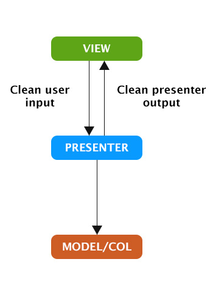

## **Tutorial** ##

### Summary###
**Introduction**
- [Building a todo list web app with Nuff.js](#intro)
- [Why Nuff.js](#why)
- [Why the Model View Presenter pattern ?](#mvp)
**Getting Started**
- [The view](#view)
- [The presenter](#presenter)
- [Models and Collections](#models)
- [The Dispatcher](#dispatcher)

### <a name="intro"></a>Building a todo list web app with Nuff.js ###
This tutorial will walk you through the creation of a basic Todo application using the Nuff.js framework. It will give you a global undestranding of the Nuff workflow and the way it's meant to be implemented.

### <a name="why"></a>Why Nuff.js ###
This framework is an attempt at a simpler communication for web applications that use a view management or templating framework, it was built to work especially well with React.js. The idea was born after I implemented flux first with vanilla js and then using Reflux. However the communication remained obscure and overcomplicated in my opinion for anyone joining a complex flux project.

#### <a name="mvp"></a>Why the Model View Presenter pattern ? ####
When first working on this project I researched coding patterns that would fit what I had in mind and MVP was something that seemed to look like what I wished to accomplish. Nuff.js is thus a loose interpretation of the MVP pattern. The fact that React views only need data objects as presentation logic makes for very simple presenters. In this sense, binding presenter methods to views allows to completely decouple views from the rest of the application. The idea being that presenters are associated to models and collections, they organize data structures into the way they need to be presented for the view. The fact that React.js relies on a simple setState method to update its views allows us to easily rerender elements after change since the preseneter is made to have a reference of the view. This avoids needless pubsub communication. The view binds events, the presenter queries models and sets the views' states accordingly.


### <a name="view"></a>Getting started : The view ###
The view as you probably know is supposed to handle representation concerns in an application. In our case it will also hold basic event logic. The idea is that the view handles visual representation and raw event treatment. It then transfers clean input to the presenter. At the top of our view we reference our Presenter.
```javascript
this.presenterMethods = ["taskDone", "add", "delete", "clearDone"];
TodoPresenter(this);
```
The view passes itself as an argument to the TodoPresenter, the presenterMethods array describes which methods are expected from our Presenter, these methods only exist in the Presenter but references will be bound to the view. After these two lines, our view now has access to all these methods. We then bind these methods either directly to event handlers or we first clean/sanitize the user input

    Note that if the presenterMethodsScope object isn't set to the view before Presenter instanciation the default scope for every presenter function call is the presenter instance.

The view can then bind events in the following way :
```javascript
document.getElementById('clear-done-button').addEventListener('click', this.clearDone); // this references the view
```


### <a name="presenter"></a>Getting started : The Presenter ###
The presenter will act as a communication hub between views and models/collections. The implementation that is advised when using Nuff presenters is to always pass a view as only parameter on initialization. The presenter will then bind methods for each provided method in the presenterMethods array attached to the view.

```javascript
var TodoPresenter = Nuff.Presenter("Todo",{
    init: function(view) {
    	this.view = view;
    }
});
```
The Nuff presenter will have several view independent methods to access models and return presentation objects. To keep the previous example :
```javascript
var TodoModel = require('../models/Todo.js');
var TodosCollection = require('../collections/Todos.js');

var TodoPresenter = Nuff.Presenter('Todo', {
    init: function(view) {

        var _this = this;
        this.view = view;
        this.list = new TodosCollection();

        this.onDispatch('todoList:update', function() {
            _this.view.setState({list: _this.list.toJSON() });
        });

    },

    add: function(_text) {
        this.list.push(
            new TodoModel({
                text: _text
            })
        );
        this.dispatch("todoList:update");
    },

    taskDone: function(_id) {
        this.list[_id].toggleDone();
        this.dispatch("todoList:update");
    },

    delete: function(_id) {
        this.list[_id].destroy();
        this.list.splice(_id,1);
        this.dispatch("todoList:update");
    },

    clearDone: function() {

        this.list.deleteWhere('done', true);
        this.dispatch("todoList:update");
    }

});

module.exports = TodoPresenter;
```

    Presenters are by default singletons, this is for the simple reason that they are meant to bind functions to views and thus do not require to be scoped. Once a instance has been created it can be used for every view. You may however declare the singleton attribute at false on construction to have an instanciable presenter

### <a name="models"></a>Getting started : Models and Collections ###
Methods and collections are data structures that allow to easily organize your app. In our TodoList application, the model is very simple and only implements a single custom method, the toggleDone method.
```javascript
var Todo = Nuff.Model('Todo', {
    attributes: {
        done: false,
        text: ""
    },

    toggleDone: function() {
        this.set("done", !this.attributes.done);
    }

});

module.exports = Todo;
```

The use of a collection in the presenter allows us to use the Collection methods deleteWhere and toJSON which were useful to update our list's content.

### <a name="dispatcher"></a>The Dispatcher ###
The Nuff dispatcher is a very simple implementation of a pubsub system that allows us to register callbacks whenever we dispatch a string. In this example a single string is registered in the presenter's init method using the following form :
```javascript
this.onDispatch('todoList:update', function() {
    _this.view.setState({list: _this.list.toJSON() });
});
```
The dispatch and onDispatch are available for presenters, models and collections. One can equally use the Nuff.Dispatcher component syntax to use the dispatcher.

    The Dispatcher is a singleton, the Nuff.Dispatcher function returns the Dispatcher instance or creates it if it doesn't exist.

```javascript
var _dispatcher = Nuff.Dispatcher();

_dispatcher.register('todoList:update', function() {
    _this.view.setState({list: _this.list.toJSON() });
});
_dispatcher.dispatch('todoList:update');

```
